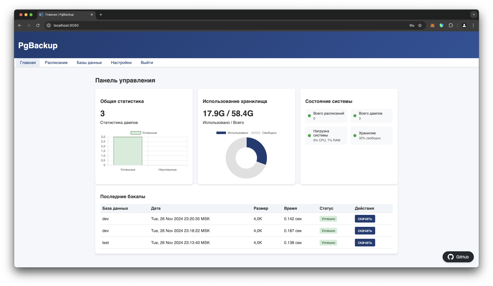

### PgBackup 
___

Легковесный и безопасный инструмент для резервного копирования PostgreSQL

#### Основные возможности:

- Создание резервных копий баз данных PostgreSQL, которые вы подключили;
- Возможность настройки параметров резервного копирования;
- Поддержка различных версий PostgreSQL (протестированы 15,16, 17 версии);
- Простота использования и установки.

Этот инструмент может быть полезен для администраторов PostgreSQL, разработчиков ПО, которым необходимо регулярно создавать резервные копии данных. Он предоставляет простой и удобный способ создания резервных копий, что помогает обеспечить сохранность данных и возможность (в разработке) их восстановления в случае сбоя.

Для установки и использования инструмента следуйте инструкциям далее. Если у вас возникнут вопросы или проблемы, вы можете обратиться за помощью к автору.

#### Функционал:

- [Страница](./docs/images/login.png) авторизации\регистрации;
- [Страница](./docs/images/main.png) с состоянием системы;
- [Страница](./docs/images/databases.png) для подключения баз данных;
- [Страница](./docs/images/schedules.png) для создания автоматических бэкапов для баз данных;
- [Страница](./docs/images/backups.png) для создания ручных бэкапов выбранной базы данных;
- [Страница](./docs/images/settings.png) с настройками приложения.

#### Установка:

Для запуска необходимы следующие переменные окружения:

`JWT_KEY`: ***(Не рекомендовано хранить в открытом виде)*** ключ для генерации токенов аутентификации;
`AES_KEY`: ***(Размер должен быть 16,24,32 смиволов)*** ключ для шифрования по алгоритму AES-256;
данных.

- Ручной запуск:

```bash
docker run -d --name pgbackup -p 8080:8080 \ 
	-v ./dumps:/app/dumps:rw -v ./data:/app/data:rw \
	-e JWT_KEY=<токен JWT> \
	-e AES_KEY=<токен AES>
	--restart=always pavelmilanov/pgbackup:latest
```

- в файле docker-compose:

```bash

services:
  pgbackup:
	image: rosomilanov/pgbackup:latest
	container_name: pgbackup
	restart: always
	environment:
		JWT_KEY: very_secret_string
		AES_KEY: very_secret_string
	volumes:
		- ./dumps:/app/dumps:rw
		- ./data:/app/data:rw
	ports:
		- 8080:8080
```
